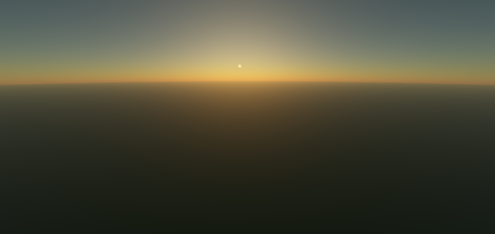

# Precomputed Physically Based Atmosphere Scattering for Unity3D

This is an implementation of atmosphere scattering effect in Unity3D.  
The effect is physically based. Heavily used code from [1].  

## Current features
Physically based calculation  
Support multi-scattering  
Runtime parameter update with little performance loss  

## How to use.
Put AtmosphereScatteringLutManager in your scene(It won't set itself as DontDestroyOnLoad, do it yourself). It does all pre-computation stuff automatically, and set current RenderSettings.Skybox to the atmosphere scattering material.  
In order to add aerial perspective, add AerialPerspective script to your camera.  

## Implementation details.
The scattering events in atmosphere are hard to simulate on real-time, so pre-computation is required, especially when multi-scattering is considered. The idea is basically the same as [1] and [2], and 3D lut is chosen to store precomputed values. the parameter of view-sun angle is omitted.  
The pre-computation aims to generate several textures, and it's possible to do these generations one by one on each frame, making it possible to change atmosphere parameters on run-time, with a little latency before update completes after several frames.  
For smooth transition between parameter updates, while sampling luts, two sets of luts will be used to smoothly lerp between them.  
Compute shader is used to do pre-computation. I find out that compute shader dispatch call time cost isn't really the time cost on GPU, so I can't give an accurate performance test. But my 1050Ti could handle this very well.  

## Known issues
When atmosphere density is high, aerial perspective around horizon is glitchy.  

## TODO
- [x] Aerial perspective on opaque objects
- [ ] Better sun disc
- [x] Auto adjusts sun intensity.
- [x] Aerial perspective on transparent objects
- [ ] Integerate volume cloud rendering.
- [ ] Optimization on rendertexture usage.
- [ ] Moon and stars.

## References
[1][Eric Bruneton. Precomputed Atmospheric Scattering: a New Implementation 2017](https://ebruneton.github.io/precomputed_atmospheric_scattering/)  
[2]‎Elek O. Rendering parametrizable planetary atmospheres with multiple scattering in real-time. 2009.
[3][Sebastien Hillaire. Physically Based Sky, Atmosphere and Cloud Rendering in Frostbite](https://blog.selfshadow.com/publications/s2016-shading-course/)  

## History.
2019/03/10 v0.1, Added README.md
2019/03/14 Added aerial perspective on opaque objects by full-screen post-processing.
2019/03/26 Now ap info is rendered into 2 3D volume texture aligned with camera, storing transmittance and scattering. I added a shader to show how to add ap effect to a transparent shader.